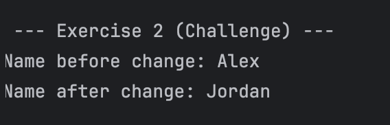
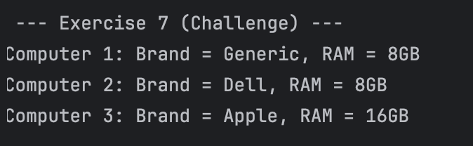

# Guided Java Lab: Mastering Methods and Encapsulation

---

## Lazaro, Cade Virgil C.

---

### Exercise 1:

#### Prediction:
Engine has started. 
The car is moving at 60 mph.

#### Actual Output:

#### Explanation: 
The message "Engine has started." will be printed first because it was called first.

---

### Exercise 2:

#### Prediction:
Before method call: 50 
Inside method: 100 
After method call: 50 

#### Actual Output:

#### Explanation:
The originalValue did not change its value after the method call because it
was not reassigned. Another variable was called for printing when the modifyValue()
method was called.

---

### Exercise 3:

#### Prediction:
Number of messages: 2 
Hello World 

Number of messages: 3 
Testing Varargs Here 

Number of messages: 0 

#### Actual Output:

#### Explanation: 
The last call for the method printMessages() will not print anything since
it has an empty parameter list.

---

### Exercise 4:

#### Prediction:
Alice has a balance of $1200.50

#### Actual Output:

#### Explanation: 
Although these variables can not be accessed directly from the Bank class since they
are private, a public method can be called in order display these values.

---

### Exercise 5:

#### Prediction:
App Name: My Awesome App 
Instance ID: ID-12345 

#### Actual Output:

#### Explanation: 
A new object class must be called to access the Instance ID method since it is not 
a static method.

---

### Exercise 6:

#### Prediction:
Number: 42 
Message: Hello 
Repeating Message: 
Goodbye 
Goodbye 
Goodbye 

#### Actual Output:

#### Explanation: 
This is an example of method overloading. It uses the same method name, but it
takes different parameters based on what the user initialized.

---

### Exercise 7:

#### Prediction:

Default pizza created.  
Size: 12 inches, Toppings: Cheese  
Pizza with custom toppings created.  
Size: 0 inches, Toppings: Pepperoni  
Fully custom pizza created.  
Size: 16 inches, Toppings: Mushroom and Onion  

#### Actual Output:

#### Explanation: 
This is an example of constructor overloading. It has the same concepts as method overloading,
however it is for class constructors. It has same constructor names but take different input 
initialized by the user.

---

### Exercise 8:

#### Prediction:
Initial temp: 22.5  
Error: Temperature must be between 10.0 and 30.0 Celsius. 
Temp after invalid change: 22.5 
Temp after valid change: 25.0 

#### Actual Output:

#### Explanation:
This showcases encapsulation and how users can practically "hide" variables that 
are only accessed by using public getters and setters.

---

## Mini Challenges:

---

---

---

---

---

---

---

---

